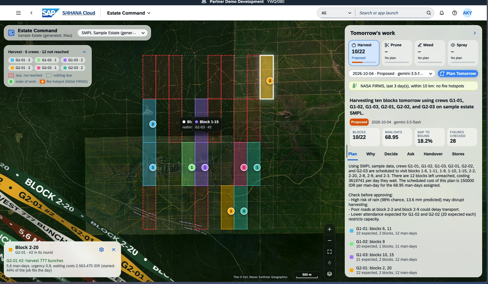
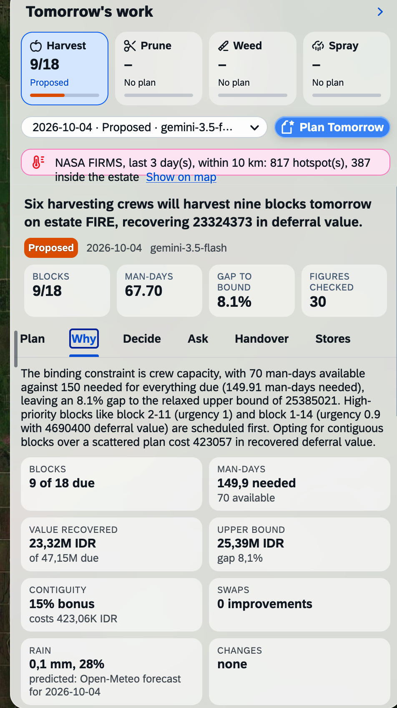
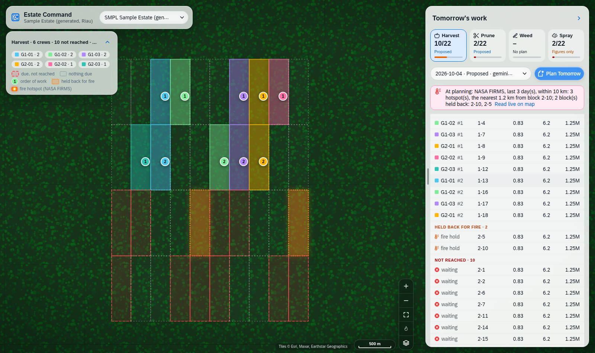
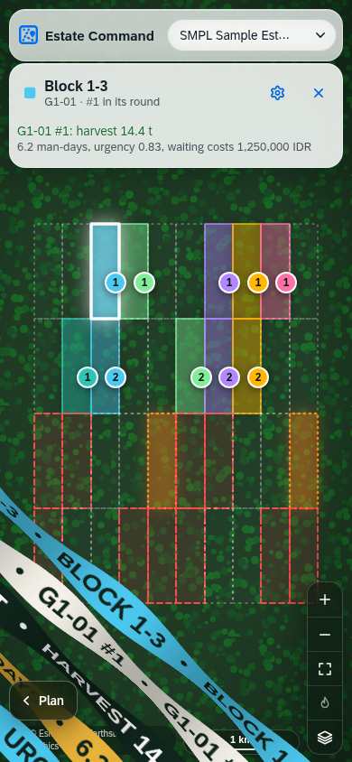
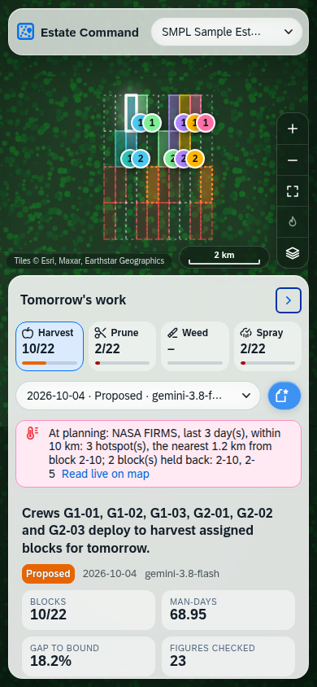
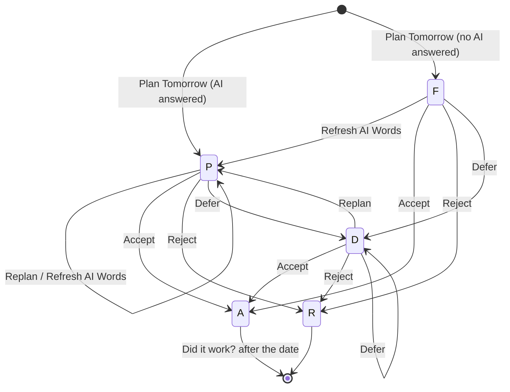
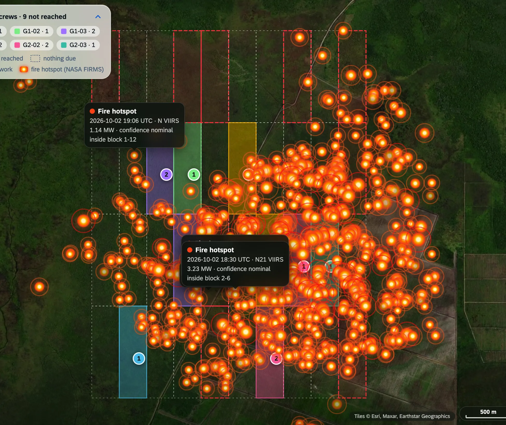

# Estate Command on SAP — Functional Specification

| | |
|---|---|
| Document | Functional Specification (FS) |
| Solution | Estate Command on SAP S/4HANA Cloud Public Edition |
| Package | `ZESTATE_CMD` |
| Version | 0.9 — Proof of Concept |
| Date | 4 October 2026 |
| Status | POC built and running in development tenant YWQ, clients 080 and 100 |
| Companion | [Technical Specification](technical-specification.md) |

---

## 1. Purpose

This document specifies **what** Estate Command does for an oil palm estate, in business terms:
who uses it, which decisions it supports, the rules it applies, what it shows and what it never
does. How it is built is in the Technical Specification.

Estate Command answers one question every afternoon, for every estate and every field operation:

> **Tomorrow, which crew goes to which block, in what order — and why?**

It answers with a plan the Assistant Manager can accept, reject or defer, with every figure
computed by the system, the reasoning written in plain language by an AI model, every number in
that language checked against the data, and the decision recorded.

## 2. Scope

### 2.1 In scope (this POC)

| # | Capability | Summary |
|---|---|---|
| C1 | Plan Tomorrow | Crew-to-block assignment for **harvest, pruning, weeding, spraying**, per estate, for the next working day |
| C2 | Why | The scheduler's figures: capacity, value recovered, gap to the theoretical best, contiguity cost, swaps, each line's urgency and cost of waiting |
| C3 | Weather | Tomorrow's rain from Open-Meteo; field work stops above a cutoff, spraying above a wash-off threshold |
| C4 | Fire watch | NASA FIRMS satellite fire hotspots around the estate; blocks next to a fire are held back from the plan |
| C5 | AI words with audit | Headline, summary, why and risks written by an AI model; every number and block label audited against the evidence |
| C6 | Replan | The same day re-planned with a changed constraint: crew out, headcount, rain, a block held, contiguity |
| C7 | Decision log | Accept / Reject / Defer with note, follow-up date and expected effect; who and when |
| C8 | Ask | A free question on the plan, answered from its figures and audited |
| C9 | Work document | The assignment drafted as a work instruction (never sent or posted) |
| C10 | Shift handover | What was decided, what is open, what to watch — over the last seven days of plans |
| C11 | Did it work? | An accepted plan read back against the work-order ledger after its date |
| C12 | Stores | What to order and by when, from real supplier lead times and use (SAP MM or sample data) |
| C13 | Assumption register | Every price, rate, round and threshold the plan uses, editable, with source and range |
| C14 | AI provider maintenance | Models, keys, priority, default; automatic fallback |
| C15 | Data import | Estate extracts (blocks, crews, attendance, orders, upkeep, stores) loaded from CSV |
| C16 | Overnight planning | An application job plans every estate and operation, ready in the morning |
| C17 | Command app | Map-first Fiori app (desktop, tablet, phone) over all of the above |

### 2.2 Out of scope (this POC)

- Posting anything to SAP: no purchase requisition, maintenance order, timesheet or goods movement.
- Pest, dispatch and mill-intake operations; FFB yield forecasting; learned models (rain, headcount,
  slippage, crew speeds) — the POC uses forecast or set rain, trailing attendance and register rates.
- Satellite vegetation indices (Sentinel-2 NDRE), fire triage of individual hotspots, the
  conversational copilot and text-to-SQL.
- Real HR, payroll or attendance integration (attendance is imported or sample).

## 3. Business context

An estate is divided into **divisions** and **blocks** (typically 25–35 ha each). Each afternoon
the Assistant Manager and the **mandors** (field supervisors) decide where each crew goes tomorrow:

- **Harvest gangs** cut fresh fruit bunches (FFB) on a rotation of 7–10 days per block. A block
  left too long loses fruit to over-ripening; a block cut too early yields little.
- **Upkeep crews** prune, circle-weed and keep paths on longer rounds (75–240 days).
- **Spray teams** apply herbicide on a ~100-day round, and must not spray before heavy rain.

The decision is made today on experience and paper. It is hard to defend ("why block 2-11 and not
1-14?"), hard to replan when a crew is short or it rains, and leaves no record of what was
decided and whether it worked. Fires on neighbouring land — common in Sumatra in the dry season —
are a safety risk that today reaches the field late.

**Estate Command** gives the manager a plan that is computed, explained, auditable and recorded,
inside SAP, next to the stores and purchasing data the estate already runs on.

## 4. Users and roles

| Role | Uses | Main actions |
|---|---|---|
| **Assistant Manager / Estate Manager** (primary) | Command app, desktop and phone | Plan Tomorrow, read Why, Replan, Accept / Reject / Defer, Ask, Handover, Did it work? |
| **Mandor / field supervisor** | Work document, phone | Reads his crew's blocks and order of work |
| **Store keeper / procurement** | Stores tab | Reads what to order and by when |
| **Estate administrator** | Fiori elements apps | Maintains estates, assumptions, data imports |
| **IT / key user** | Fiori elements, ADT, launchpad apps | AI providers and keys, communication arrangements, jobs |

Access is granted through business catalog `ZEST_COMMAND_BC` assigned to a business role.

## 5. Guiding principles

These are functional rules, not implementation choices. Every feature below obeys them.

| # | Principle | What the user sees |
|---|---|---|
| P1 | **The system computes, the model writes.** | Every figure on screen comes from the scheduler; the AI only words it. |
| P2 | **The guardrail is checked, not trusted.** | "Figures checked: 23"; any number or block in the text not found in the data is listed as *unverified*. |
| P3 | **A plan never depends on the AI.** | If every AI provider fails, the plan is still made with status **F** (*figures only*). |
| P4 | **Nothing is posted.** | Plans and work documents are drafts and decisions; no SAP document is created. |
| P5 | **Every assumption is visible.** | Prices, rates and thresholds come from the register, with their source; the plan lists the ones it used. |
| P6 | **Sample data says so.** | Sample estates are flagged; the AI text says once that the data is sample data. |
| P7 | **Safety first.** | Rain stops work above the cutoff; blocks next to a fire are held back. |

## 6. Functional requirements

Requirement IDs (FR-*) are referenced by the acceptance tests in section 12.

### 6.1 Estates, blocks and crews (C15)

| ID | Requirement |
|---|---|
| FR-ES-01 | An **estate** has an ID, name, optional SAP plant and storage location (for Stores), coordinates (for weather and fire), currency, default AI provider, a *sample* flag and the last day its data covers. |
| FR-ES-02 | A **block** has division, code, label (e.g. `1-12`), planted hectares, palms, planting year, average bunch weight, harvest rotation (days), harvest gang, road condition, expected bunches per day, centroid and polygon. |
| FR-ES-03 | A **crew** has a type (harvest, upkeep, spray), name, division, establishment (people on roll), harvesters and a home block. |
| FR-ES-04 | Daily **attendance** per crew (on roll, present), the **work-order ledger** (planned/actual quantity, headcount, man-days, status) and the **upkeep round state** (last done, interval) per block and activity are the history the plan is computed from. |
| FR-ES-05 | Estates are maintained in the *Estate* app (create, edit with draft, delete). Blocks, crews, attendance, orders, upkeep and stores records are **imported** (FR-IM). |
| FR-ES-06 | "Tomorrow" for an estate is the first day after the last day its data covers. |

### 6.2 What is due (demand)

| ID | Requirement |
|---|---|
| FR-DM-01 | **Harvest:** for each block, days since the last cut, the ripening rate over the lookback (bunches cut ÷ lookback days), bunches ready = rate × days since, tonnes = bunches × bunch weight, value = tonnes × FFB price. **Urgency** = days since ÷ rotation. |
| FR-DM-02 | **Upkeep (prune, circle weeding, path upkeep, spray):** days since the last completed round ÷ round interval = urgency; a block is due at urgency ≥ 0.85, or when a round is in progress. Quantity = palms (prune) or hectares (weeding, paths, spray). |
| FR-DM-03 | **Cost of waiting:** each due block carries a *deferral per day* = block value × loss rate per overdue day × an urgency weight (clamped 0.2–2.5), and a *deferral* over its horizon (harvest: its rotation; upkeep: 7 days). The plan ranks on this. |
| FR-DM-04 | **Man-days** needed = quantity ÷ the register rate (e.g. 138 bunches, 55 palms, 1.1 ha circle weeding per man-day). |

### 6.3 Plan Tomorrow (C1)

| ID | Requirement |
|---|---|
| FR-PL-01 | The user picks an estate and an operation and presses **Plan Tomorrow**. The plan is for the estate's "tomorrow" (FR-ES-06). |
| FR-PL-02 | **Capacity:** each crew of the operation's type brings one man-day per person expected present (a harvest gang counts only its cutters: present × harvesters ÷ establishment). Expected present = recorded attendance on the day if known, else the crew's mean attendance over `attendance_lookback_days`, applied to its roll (85 % when nothing is recorded). A replan may set a crew's headcount or take a crew out. |
| FR-PL-03 | **Assignment:** blocks are assigned greedily by *value density* (deferral recovered per man-day), round-robin across crews, adding a **contiguity bonus** for a block next to the crew's previous one and subtracting **travel** time at the man-day cost. A crew stops below 0.35 man-days left; a block may be **started partially** if at least 30 % of it fits. |
| FR-PL-04 | A **swap pass** then tries exchanging blocks between crews and keeps any exchange that raises value recovered. |
| FR-PL-05 | The plan reports the **relaxed upper bound** (fractional knapsack, no geography) and the **gap** to it, so the greedy choice is accountable. |
| FR-PL-06 | The plan reports **what contiguity cost**: value recovered with and without the bonus. |
| FR-PL-07 | The plan names the **binding constraint** in a sentence (e.g. "crew capacity: 70 man-days against 150 needed"). |
| FR-PL-08 | Each assigned line shows crew, order of work (#1, #2 …), block, activity, quantity, man-days, share of the job that fits the day, urgency, days since, target, block value, deferral, travel km and cost, contiguity, road condition, and a note. |
| FR-PL-09 | Due blocks nobody reaches are listed as **not reached** with what each costs per day it waits (up to 40 lines), most valuable first. |
| FR-PL-10 | A plan has a status: **P** proposed (AI words), **F** figures only (no AI words), **A** accepted, **R** rejected, **D** deferred. |
| FR-PL-11 | Plans are kept; every estate and operation shows its plan history, newest first. |

### 6.4 Weather (C3)

| ID | Requirement |
|---|---|
| FR-WX-01 | Tomorrow's rain (mm) and chance of rain (%) come from the Open-Meteo forecast at the estate's coordinates, when the register switch `use_rain_forecast` is on and the connection exists. |
| FR-WX-02 | Without a forecast the plan says *rain unknown* with the reason, and plans without it — it never invents a figure. |
| FR-WX-03 | Rain ≥ `rain_cutoff_mm` (45 mm) **stops field work**: the plan says so and assigns nothing. |
| FR-WX-04 | For **spraying**, rain ≥ `spray_rain_mm` (15 mm) stops the round (herbicide washes off). |
| FR-WX-05 | A replan may **set** the rain by hand; it replaces the forecast and is shown as *set on the plan*. |

### 6.5 Fire watch (C4)

| ID | Requirement |
|---|---|
| FR-FI-01 | Active fire hotspots are read from **NASA FIRMS** (VIIRS on Suomi NPP, NOAA-20, NOAA-21; MODIS on Terra and Aqua) for the box around the estate's blocks, over the last `fire_days` (default 3, at most 5). |
| FR-FI-02 | Hotspots farther than `fire_radius_km` (default 10 km) from the nearest block are ignored. Each kept hotspot carries its distance to the nearest block and whether it lies **inside** a block. |
| FR-FI-03 | **Plan rule:** a due block whose centre lies within `fire_hold_km` (default 1 km; 0 = off) of a hotspot is **held back for fire**: not assigned, shown as its own line "held back for fire: hotspot 0.62 km away (N20 2026-10-03, 18.4 MW)", still counted as due. |
| FR-FI-04 | The plan keeps its **fire picture**: a sentence (e.g. "NASA FIRMS, last 3 day(s), within 10 km: 817 hotspot(s), 387 inside the estate; 9 block(s) held back: 1-6, …") and the number of held blocks. |
| FR-FI-05 | The AI is given the fire picture, the held blocks and the five nearest hotspots, and is told to put **fire first among the risks**. |
| FR-FI-06 | Without the connection or the map key the plan says *fires unknown* and holds nothing. |
| FR-FI-07 | In the app, live hotspots are read **only on request** (fire button or *Read live on map*); until then the panel shows the fire picture saved with the plan. |

### 6.6 AI words and audit (C5)

| ID | Requirement |
|---|---|
| FR-AI-01 | After the figures are computed, an AI model writes: **headline** (≤ 120 characters, what the crews do tomorrow), **summary** (2–3 sentences), **why** (2–4 sentences: priorities, binding constraint, gap, contiguity) and **risks** (≤ 3 lines to check before approving). |
| FR-AI-02 | The model receives only the evidence: the computed figures, weather, fire, crews and lines, not-reached blocks and the assumptions used. It is told to quote figures verbatim and never compute. |
| FR-AI-03 | **Audit:** every number and block label in the words is looked for in the evidence. If any is missing, the model is asked once to rewrite without them; the better of the two is kept. The plan shows *figures checked* and any *unverified* figures. |
| FR-AI-04 | **Fallback:** providers are tried in order — the requested one (or the estate's default), then the others by priority. The first that answers is used. |
| FR-AI-05 | If all fail, the plan is saved with status **F**, a figures-only headline and every provider's failure reason. |
| FR-AI-06 | **Refresh AI Words** rewrites the words on the stored figures, optionally with another provider; nothing is recomputed. |

### 6.7 Replan (C6)

| ID | Requirement |
|---|---|
| FR-RP-01 | On an open plan (not accepted or rejected) the user may replan the same day with: a **crew out**; a **headcount** for one crew; **rain** set by hand; a **block held back**; a different **contiguity bonus**; or *clear earlier changes*. |
| FR-RP-02 | The changes are stored on the plan ("Changes set on the plan") and the plan is recomputed, re-read for weather and fire, and re-worded. |

### 6.8 Decision log (C7)

| ID | Requirement |
|---|---|
| FR-DL-01 | **Accept**, **Reject** or **Defer** an open plan with a note, a *look again on* date (deferral) and the *expected effect*. |
| FR-DL-02 | The system records who decided and when. An accepted or rejected plan is closed: no replan, no further decision. |
| FR-DL-03 | **Did it work?** (Outcomes): for an accepted plan whose date has passed, each line is compared with the ledger — planned vs actual quantity, adherence %, status. |

### 6.9 Ask, work document and handover (C8–C10)

| ID | Requirement |
|---|---|
| FR-AS-01 | **Ask:** a free question on the plan ("G1-01 is four men short tomorrow — which blocks wait?") is answered from the plan's evidence, audited like the plan words. |
| FR-WD-01 | **Work document:** the assignment as instructions per crew; the system fills in the lines, the model writes the instructions. Never sent, never posted. |
| FR-HO-01 | **Shift handover:** over the estate's plans of the last seven days: a headline, what was decided, open positions, a watch list and a note. |

### 6.10 Stores (C12)

| ID | Requirement |
|---|---|
| FR-ST-01 | For each material of the estate's store: stock on hand and on order, daily use, the supplier's quoted and **real** lead time (usual, and "1 in 10 orders takes N days or more"), share of very late deliveries. |
| FR-ST-02 | **Reorder point** = the service-level quantile (default 95 %) of 2,000 simulated lead-time demands (real lead times × daily use with its weekly spread). With the stock model off, SAP's own reorder point is used. |
| FR-ST-03 | The answer leads with a sentence: **Order now: 32,000 l**, or **Covered; order by 12 Oct: 720 l**, with the order quantity covering `order_cover_weeks` (6) of use, rounded to the material's rounding value. |
| FR-ST-04 | An estate with a **plant** reads SAP MM (material master, MRP settings, stock, purchase orders and goods receipts, goods issues); without a plant it reads the sample records. |

### 6.11 Assumption register (C13)

| ID | Requirement |
|---|---|
| FR-AR-01 | Every value the plan uses lives in the register with a label, value, unit, default, **source** (assumed / measured / client), basis, where it is used, and a min–max range. |
| FR-AR-02 | Values are edited in the *Assumption* app (Edit → change → Save). A value outside its range is refused. A changed value is marked as the client's; **Back to Default** restores it. |
| FR-AR-03 | Each plan lists, in its evidence, the assumptions it used. |

Register entries (defaults):

| Group | Key | Default | Unit |
|---|---|---|---|
| Pricing | `ffb_price_idr_kg` | 2,600 | IDR/kg |
| | `abw_kg` | 8 | kg average bunch weight |
| | `man_day_cost_idr` | 150,000 | IDR |
| Harvest | `harvest_loss_pct_per_day_overdue` | 1.5 | % of crop value per day past the round |
| | `harvest_bunches_per_man_day` | 138 | bunches |
| | `harvest_ripening_lookback_days` | 30 | days |
| Upkeep rates | `prune_palms_per_man_day` | 55 | palms |
| | `circle_weed_ha_per_man_day` | 1.1 | ha |
| | `path_upkeep_ha_per_man_day` | 1.5 | ha |
| | `spray_ha_per_man_day` | 2.6 | ha |
| | `upkeep_loss_pct_per_day_overdue` | 0.03 | % of annual yield per day overdue |
| Rounds | `prune_interval_days` / `circle_weed_interval_days` / `path_upkeep_interval_days` / `spray_interval_days` | 240 / 75 / 110 / 100 | days |
| Scheduling | `work_day_hours` | 7 | hours |
| | `crew_transport_km_per_hour` | 15 | km/h |
| | `contiguity_bonus_pct` | 15 | % of block value |
| | `attendance_lookback_days` | 14 | days |
| Forecasting | `use_rain_forecast` | 1 | on/off |
| | `rain_cutoff_mm` | 45 | mm |
| | `spray_rain_mm` | 15 | mm |
| | `fire_radius_km` | 10 | km |
| | `fire_hold_km` | 1 | km |
| | `fire_days` | 3 | days (1–5) |
| Stores | `use_stock_model` | 1 | on/off |
| | `service_level_pct` | 95 | % |
| | `order_cover_weeks` | 6 | weeks |
| | `consumption_window_days` | 56 | days |

### 6.12 AI providers (C14)

| ID | Requirement |
|---|---|
| FR-PR-01 | Providers are rows with type (Gemini, Bedrock, BytePlus), model, communication scenario, outbound service, API path and revision, region, max tokens, temperature, active, default and priority. |
| FR-PR-02 | The API key is either the row's key or the communication arrangement's `API_KEY` property. |
| FR-PR-03 | Maintained in the *AI Provider* app with draft (Edit → API Key → Save). |
| FR-PR-04 | The NASA FIRMS map key is held in the inactive row `FIRMS` (never used as an AI provider). |

### 6.13 Data import (C15)

| ID | Requirement |
|---|---|
| FR-IM-01 | The *Data Import* app accepts a CSV per **kind**: blocks, crews, attendance, orders, upkeep, MM (stores). The header row names the columns; order does not matter; `#` lines are comments. |
| FR-IM-02 | Create → choose kind and estate → upload → **Save** → **Load**. Loading replaces the estate's rows of that kind (for orders: only the operations present in the file). |
| FR-IM-03 | The import shows status (uploaded / loaded / error), rows loaded and a message. A draft cannot be loaded. |

### 6.14 Overnight planning (C16)

| ID | Requirement |
|---|---|
| FR-JB-01 | Application job template `ZEST_PLAN_JOB_T` creates tomorrow's plan for every estate and operation; scheduled daily (e.g. 18:00) so plans wait in the morning. |
| FR-JB-02 | A plan whose AI step failed is still created (status F). |

## 7. Command app — user interface

### 7.1 Layout

*Real system, estate SMPL, harvest plan, block 2-20 selected.*

| Area | Content |
|---|---|
| **Map** (full screen) | Satellite imagery; blocks coloured by crew and numbered by order of work; due-but-not-reached blocks with a pulsing red dashed outline; blocks held for fire in orange; blocks with nothing due as faint dashed outlines; labels from zoom 15. |
| **Top bar** (top left) | App name, estate name, estate picker. |
| **Legend** (below, collapsible) | Operation, crews and counts, held/not reached counts, keys. |
| **Plan panel** (right, collapsible, resizable) | Operation tiles (latest plan of each: coverage, status, bar) → plan picker and **Plan Tomorrow** → fire strip → headline, status, KPI tiles → tabs **Plan · Why · Decide · Ask · Handover · Stores**. |
| **Block card** (bottom left) | Block, crew and order, plan lines; opens the block's kinetic ribbons. |
| **Map buttons** (bottom right) | Zoom in/out, fit estate, live fire layer menu, basemap menu; scale and attribution along the bottom. |

### 7.2 Behaviour

| ID | Requirement |
|---|---|
| FR-UI-01 | The app opens with **no estate chosen**: the map shows Sumatra, the panel says *Choose an estate…*. Nothing is read until an estate is chosen. |
| FR-UI-02 | Choosing an estate loads its blocks and the plans of all four operations; the latest plan of the selected operation is shown. |
| FR-UI-03 | Clicking an **operation tile** shows that operation's plans. The plan picker lists the operation's plan history. |
| FR-UI-04 | **Plan Tomorrow** creates a new plan and shows it; the toast says which model wrote it and how many figures were audited, or that the plan is figures only and why. |
| FR-UI-05 | **Why** shows the figure cards (blocks, man-days, value recovered, upper bound, contiguity, swaps, rain, fire, changes) and the line grid grouped **Reached**, **Held back for fire**, **Not reached**, with cost per day of waiting. |
| FR-UI-06 | **Decide** holds Accept / Reject / Defer with note, date and expected effect; Work Document; a folded **Replan** form; a folded decision log and work document. |
| FR-UI-07 | Clicking a block opens the **block card** and runs the block's facts across the map as kinetic ribbons (FR-UI-12). |
| FR-UI-08 | The plan panel **collapses** to a *Plan* handle and is **resizable** by dragging its left edge (arrow keys on the edge; double-click resets); its width is remembered per user. |
| FR-UI-09 | The **fire strip** shows the fire picture saved with the plan ("At planning: …") until the user reads live ("Now: …") with *Read live on map* or the fire button. |
| FR-UI-10 | The **fire layer**: small dots sized by fire power, latest day brighter; detections within 375 m merged into one dot listing each satellite pass; sources selectable (VIIRS on, MODIS off by default); remembered per user. |
| FR-UI-11 | **Basemaps:** satellite, terrain, dark — picked from a menu with a picture of each. |
| FR-UI-12 | **Block ribbons:** the block's facts (block, crew and order, work due, man-days, urgency, cost of waiting, travel, area and palms, planted, road, division) run on twisting ribbons in the lower-left corner; they run in from the bottom right and leave to the top left. Configurable (gear): preset, colours, facts, angle, number of stripes, thickness, twist, ripple, speed, text size, capitals, animate; remembered per user. |
| FR-UI-13 | Follows the user's launchpad theme (light or dark); panels are frosted glass; all buttons and fields are rounded glass pills. |

*Real system, estate FIRE: fire strip, Why figure cards with live Open-Meteo rain.*

*Local preview with sample data: blocks held for fire (orange), the "Held back for fire" group.*

### 7.3 Phone

| ID | Requirement |
|---|---|
| FR-UI-20 | The app opens on phones (launchpad device type *phone*). |
| FR-UI-21 | The plan panel becomes a sheet over the lower 60 %; operation tiles compact; Plan Tomorrow as an icon. |
| FR-UI-22 | Tapping a block lowers the sheet so the map, block card and ribbons have the screen; *Plan* brings the sheet back. No hover tooltips on touch screens. |

| Block tapped | Plan sheet up |
|---|---|
|  |  |

### 7.4 Fiori elements apps (administration)

Generated from service `ZUI_EST_CMD_O4` (list report / object page), draft-enabled where editable:

| App (entity) | Purpose |
|---|---|
| Plan | Plans with all figures, lines, decision fields; actions |
| Estate | Estates (create, edit, delete) |
| Assumption | The register (edit, Back to Default) |
| Data Import | CSV upload and Load |
| AI Provider | Providers and keys |
| Stores | What to order (read only) |

## 8. Status and decision lifecycle

| Status | Meaning | Allowed |
|---|---|---|
| P | Proposed, with AI words | Replan, Accept, Reject, Defer; Refresh words, Ask, Work document |
| F | Figures only (AI failed) | Same as P |
| D | Deferred, with a look-again date | Same as P (a deferred plan can be deferred again) |
| A | Accepted — closed | Refresh words, Ask, Work document, Did it work? (Replan and decisions disabled) |
| R | Rejected — closed | Refresh words, Ask, Work document (Replan and decisions disabled) |

## 9. Business rules

| ID | Rule |
|---|---|
| BR-01 | Tomorrow = first day after the estate's last data day. |
| BR-02 | A crew's capacity = its expected present in man-days (harvest: cutters only); a crew only takes work of its own type (harvest gangs harvest, upkeep crews prune and weed, spray teams spray). |
| BR-03 | Rain ≥ `rain_cutoff_mm` stops field work; spraying stops at ≥ `spray_rain_mm`. |
| BR-04 | A due block within `fire_hold_km` of a fire hotspot is held back; held blocks still count as due. |
| BR-05 | A block may be started partially only if ≥ 30 % of it fits the crew's remaining day. |
| BR-06 | Contiguity bonus applies only to a block adjacent (vertices within ~55 m) to one the crew already has. |
| BR-07 | Travel costs the crew's time in transit — distance ÷ `crew_transport_km_per_hour`, as a share of `work_day_hours` — at the man-day cost. |
| BR-08 | Every figure in AI text must appear in the evidence; otherwise it is reported unverified. |
| BR-09 | An accepted or rejected plan cannot be replanned or decided again. |
| BR-10 | Nothing in the system posts to SAP. |
| BR-11 | An assumption value outside its min–max is refused. |
| BR-12 | Without a plant, Stores uses sample records and says so. |

## 10. Sample estates

| Estate | Where | Purpose |
|---|---|---|
| **SMPL** — Sample Estate (generated, Riau) | Over a real planted grid near Kantor Tasik Harapan, Rokan Hulu, Riau | 40 blocks of 300 m × 1,000 m (two divisions of 4 × 5), 9 crews, 45 days of attendance and harvest ledger, upkeep rounds, stores records |
| **FIRE** — Fire Watch Sample (date, Sumatra) | Centred on the densest cluster of VIIRS hotspots in Sumatra over the last two days (Malay peninsula excluded) | The same 40-block estate, so the fire rule and fire layer have something to show; rebuilt on each seed run to follow the fires |

*Real system, estate FIRE, live hotspots (earlier marker style).*

## 11. Non-functional requirements

| Area | Requirement |
|---|---|
| Platform | Runs inside SAP S/4HANA Cloud Public Edition as ABAP Cloud; no side-car servers. |
| Performance | Plan Tomorrow completes within ~10–30 s (dominated by the AI call; FIRMS adds 4–8 calls). The app shows a busy indicator. Estate load reads only SAP tables. |
| Availability | Plans do not depend on AI (P3), weather or fire (unknown is stated). |
| Security | Access via business catalog; outbound calls only through communication arrangements; keys never shown in the app; nothing posts. |
| Auditability | Prompt, raw answer, model, tokens, audit result, who decided and when are stored with each plan. |
| Usability | Desktop, tablet, phone; light and dark themes; keyboard operable (map buttons, menus, resize edge); reduced-motion respected by default. |
| Data | All tables client-dependent; estates separated by key. |
| Cost | FIRMS free tier (5,000 transactions / 10 min); AI calls per plan: 1–2 (rewrite pass) per provider tried. |

## 12. Acceptance scenarios (UAT)

| # | Scenario | Steps | Expected | FR |
|---|---|---|---|---|
| T01 | First plan | Choose SMPL, Harvest, Plan Tomorrow | Plan P with headline, KPIs, crews; toast names the model and audited figures | FR-PL-01..10, FR-AI-01 |
| T02 | Audit | Open Why | Figures checked > 0; unverified empty or listed | FR-AI-03 |
| T03 | AI fallback | Deactivate the default provider's key, Plan Tomorrow | Plan made by the next provider | FR-AI-04 |
| T04 | All AI down | Deactivate all providers | Plan F, figures-only headline, every failure listed | FR-AI-05 |
| T05 | Rain stop | Replan with rain 50 mm | "Work stops: 50 mm … above the 45 mm cutoff", nothing assigned | FR-WX-03 |
| T06 | Spray wash-off | Spray, replan rain 20 mm | Spraying stops | FR-WX-04 |
| T07 | Crew out | Replan with crew G1-02 out | G1-02 absent; its blocks reassigned or not reached | FR-RP-01 |
| T08 | Fire hold | Choose FIRE, Plan Tomorrow | Blocks within 1 km of a hotspot held back; fire strip red; risks name fire | FR-FI-03..05 |
| T09 | Fire hold off | Set `fire_hold_km` = 0, replan FIRE | No block held; fire still in the risks | FR-FI-03 |
| T10 | Live fires | Fire button → Live hotspots | Hotspots drawn; strip "Now: …"; sources selectable | FR-FI-07, FR-UI-10 |
| T11 | Accept | Decide → Accept with note | Status A, decided by/at; Replan disabled | FR-DL-01..02 |
| T12 | Ask | Ask "Which blocks wait?" | Answer from the plan, audited | FR-AS-01 |
| T13 | Handover | Handover → Write Shift Handover | Decided / open / watch over 7 days | FR-HO-01 |
| T14 | Stores | Stores → Read the Store (SMPL) | FU-001 "Order now", AC-001 / FE-001 "Covered; order by …" | FR-ST-01..03 |
| T15 | Register range | Set `rain_cutoff_mm` beyond its max | Save refused with the range | FR-AR-02 |
| T16 | Import | Upload blocks CSV for a new estate, Save, Load | Rows loaded; blocks on the map | FR-IM-01..03 |
| T17 | Job | Run `ZEST_PLAN_JOB_T` | One plan per estate × operation | FR-JB-01 |
| T18 | Phone | Open on a phone, tap a block | Sheet lowers; card and ribbons shown | FR-UI-20..22 |

## 13. Roadmap after the POC

1. **Post the accepted plan** as work orders / timesheet pre-entries (Plant Maintenance or a custom
   field-activity object), with approval.
2. **Learned models** from the Python edition: rain, headcount, slippage, crew speed; FFB yield
   ensemble with conformal bands.
3. **Fire triage**: hotspot persistence, spread direction, alerting the nearest crew by SMS/WhatsApp.
4. **Mill-side**: FFB dispatch and mill intake balancing.
5. **Multi-estate dashboard** for the plantation head office.
6. **Credential hardening**: keys in communication arrangement properties or the SAP Credential Store.

## 14. Glossary

| Term | Meaning |
|---|---|
| Block | A planted field unit, typically 25–35 ha |
| Division | A group of blocks under one assistant |
| Mandor | Field supervisor of a crew |
| Gang | Harvest crew |
| FFB | Fresh fruit bunches |
| ABW | Average bunch weight |
| Rotation / round | Days between two harvests / upkeep passes on a block |
| Urgency | Days since last done ÷ the target interval |
| Deferral | What waiting costs, in IDR |
| Contiguity | Keeping a crew on adjacent blocks |
| Upper bound | The best value recoverable if blocks could be split freely and travel did not matter |
| FIRMS | NASA Fire Information for Resource Management System |
| VIIRS / MODIS | Satellite fire sensors (375 m / 1 km pixels) |
| FRP | Fire radiative power, MW |
| Figures only (F) | A plan made without AI words |
