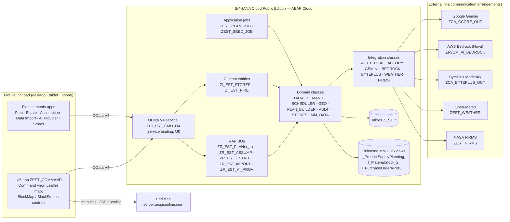
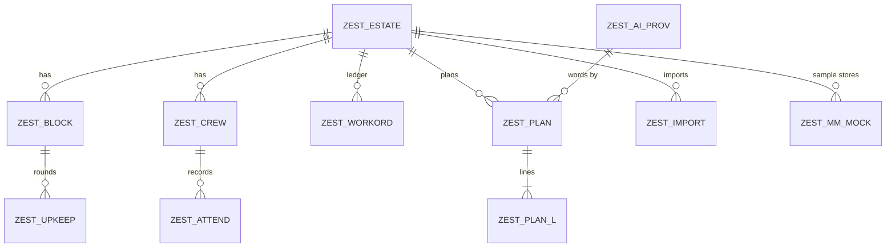
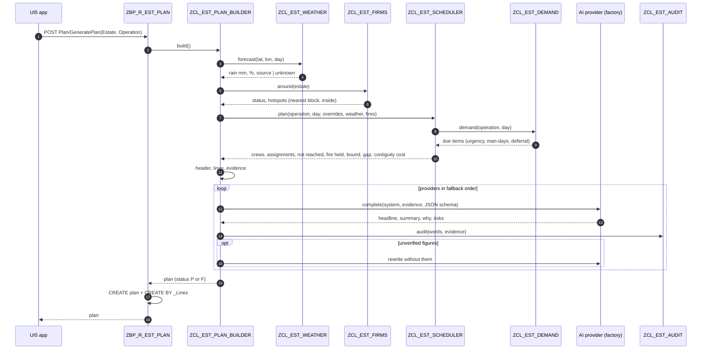
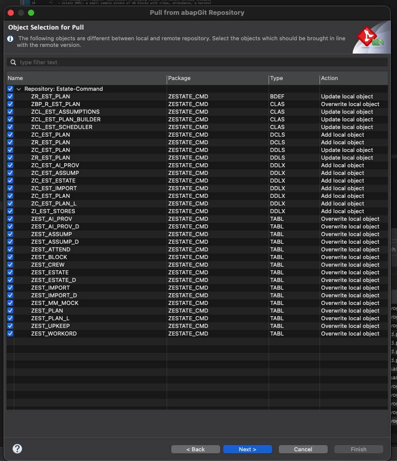

# Estate Command on SAP — Technical Specification

| | |
|---|---|
| Document | Technical Specification (TS) |
| Solution | Estate Command on SAP S/4HANA Cloud Public Edition |
| Package | `ZESTATE_CMD` (repository `yoga56/estate-command`, folder `sap/`) |
| Version | 0.9 — Proof of Concept |
| Date | 4 October 2026 |
| Landscape | Development tenant YWQ: client 080 (development, ADT), client 100 (customizing / test) |
| Companion | [Functional Specification](functional-specification.md) |

---

## 1. Architecture

### 1.1 Overview

Everything runs **inside** S/4HANA Cloud Public Edition as ABAP Cloud (language version 5, released
APIs only). There is no side-car server: the AI models, the weather and the fire feed are called
from ABAP through communication arrangements; the UI is a UI5 application in the SAPUI5 ABAP
repository, launched from the Fiori launchpad.



### 1.2 Design principles (technical)

| # | Principle | Implementation |
|---|---|---|
| T1 | Server computes, model words | `ZCL_EST_SCHEDULER` / `ZCL_EST_DEMAND` / `ZCL_EST_STORES` produce every figure; `ZCL_EST_PLAN_BUILDER` builds the *evidence* text and only asks the model to word it (JSON schema). |
| T2 | Guardrail checked | `ZCL_EST_AUDIT` tokenises numbers and block labels in the words and looks for each in the evidence; one rewrite pass. |
| T3 | Graceful degradation | Every external call is optional: AI → status F; weather → *unknown*; fire → *unknown*, nothing held. |
| T4 | ABAP Cloud only | Released APIs (`CL_WEB_HTTP_CLIENT_MANAGER`, `CL_HTTP_DESTINATION_PROVIDER`, `CL_COM_ARRANGEMENT_FACTORY`, `CL_BALI_LOG`, `/UI2/CL_JSON`, `CL_ABAP_CONTEXT_INFO`), released MM CDS views, RAP. |
| T5 | Nothing posts | No BAPI/EML on standard BOs; only own tables. |
| T6 | Deterministic sample | Seed data from a fixed LCG sequence; the FIRE estate from live data at seed time. |

### 1.3 Technology stack

| Layer | Technology |
|---|---|
| Platform | SAP S/4HANA Cloud Public Edition (developer extensibility, ABAP Cloud); portable to the SAP BTP ABAP environment |
| Persistence | Transparent tables (client-dependent), draft tables |
| Model | CDS view entities, custom entities, abstract entities |
| Behaviour | RAP managed BOs, `strict ( 2 )`, draft where edited in Fiori elements |
| Service | OData V4 UI service binding `ZUI_EST_CMD_O4` |
| UI | SAPUI5 ≥ 1.136 (freestyle), Leaflet 1.9.4 (vendored), Horizon themes; Fiori elements V4 for admin |
| Tooling | ADT (Eclipse), abapGit (ADT plug-in), SAP Business Application Studio + Fiori tools (`fiori deploy`), abaplint |
| Integrations | Gemini Interactions API, AWS Bedrock Converse, BytePlus ModelArk chat completions, Open-Meteo forecast, NASA FIRMS area CSV |

## 2. Object inventory

### 2.1 Persistence

| Table | Key | Purpose |
|---|---|---|
| `ZEST_ESTATE` (+`_D`) | estate | Estate master: name, plant, storage location, coordinates, currency, default provider, sample flag, data end |
| `ZEST_BLOCK` | estate, block_key | Blocks: division, code, label, ha, palms, planted year, ABW, rotation, gang, road, bunches/day, centroid, polygon (`lon lat,…`) |
| `ZEST_CREW` | estate, crew_code | Crews: type, name, division, establishment, harvesters, home block |
| `ZEST_ATTEND` | estate, crew_code, work_date | Attendance: on roll, present |
| `ZEST_WORKORD` | estate, order_id | Work-order ledger: date, operation, activity, block, crew, headcount plan/actual, qty plan/actual, unit, man-days plan/actual, status, carried to |
| `ZEST_UPKEEP` | estate, block_key, activity | Upkeep round state: last done, interval |
| `ZEST_ASSUMP` (+`_D`) | assumption_key | Assumption register: label, value, default, unit, source, basis, used by, min, max, group, sort |
| `ZEST_PLAN` | plan_uuid | Plan header: estate, operation, date, status, capacity, due/assigned, deferral, value recovered, upper bound, gap, contiguity, swaps, rain, weather source, **fire text, fire held**, stops work, overrides (JSON), headline, summary, why, audit, provider, model, tokens, error, prompt, raw response, decision fields, artifact |
| `ZEST_PLAN_L` | line_uuid | Plan line: assigned flag, crew, range, present, sequence, block, activity, qty, man-days, share, urgency, days since, target, value, deferral, contiguity, travel km/cost, score, contiguous, road, criticality, note |
| `ZEST_IMPORT` (+`_D`) | import_uuid | CSV upload: kind, estate, file name, MIME, attachment (RAWSTRING), status, rows, message |
| `ZEST_AI_PROV` (+`_D`) | provider_id | AI providers: type, description, model, scenario, outbound service, path, revision, **API key (STRING)**, region, max tokens, temperature, active, default, priority |
| `ZEST_MM_MOCK` | estate, row_id | Sample MM records (material, stock, PO, GR, GI) with dates as day offsets |

Draft tables `*_D` carry the CDS element names plus `.INCLUDE SYCH_BDL_DRAFT_ADMIN_INC`.



### 2.2 CDS and service

| Object | Kind | Notes |
|---|---|---|
| `ZR_EST_PLAN`, `ZR_EST_PLAN_L` | Root/child view entities | `LineNumber` alias (LINENO is reserved) |
| `ZC_EST_PLAN`, `ZC_EST_PLAN_L` | Projections, `transactional_query` | DDLX for the object page; DCLS `where TRUE` |
| `ZR/ZC_EST_ASSUMP`, `ZR/ZC_EST_ESTATE`, `ZR/ZC_EST_IMPORT`, `ZR/ZC_EST_AI_PROV` | Root/projection | Draft-enabled; DDLX each |
| `ZI_EST_BLOCK` | View entity | Blocks for the map |
| `ZI_EST_STORES` | Custom entity | `ZCL_EST_STORES_QUERY` |
| `ZI_EST_FIRE` | Custom entity | `ZCL_EST_FIRE_QUERY`: status row (`IsStatus`) + hotspots |
| `ZI_EST_AI_PROV_VH`, `ZI_EST_ESTATE_VH` | Value helps | Activated before the `ZA_*` parameters |
| `ZA_EST_GEN_PLAN`, `ZA_EST_REPLAN`, `ZA_EST_PROVIDER`, `ZA_EST_DECISION`, `ZA_EST_QUESTION`, `ZA_EST_ANSWER`, `ZA_EST_ESTATE_P`, `ZA_EST_HANDOVER`, `ZA_EST_OUTCOME` | Abstract entities | Action parameters and results |
| `ZUI_EST_CMD_O4` | Service definition | Exposes Plan, PlanLine, Estate, Assumption, DataImport, Block, Stores, **Fire**, AIProvider, AIProviderVH, EstateVH |
| `ZUI_EST_CMD_O4` | Service binding (OData V4 UI) | Created in ADT, ignored by abapGit |

### 2.3 Classes

| Class | Responsibility |
|---|---|
| `ZCL_EST_DATA` | One estate's state read once per request (blocks with rings and centroids, crews, attendance, ledger, upkeep); expected headcount; default plan date; number formatting |
| `ZCL_EST_GEO` | Ring parse/format, centroid, equirectangular km, adjacency by vertex grid hash (~55 m), range labels ("14-19, 23") |
| `ZCL_EST_DEMAND` | What is due per operation with urgency, quantity, man-days, value, deferral |
| `ZCL_EST_SCHEDULER` | Crews and capacity, fire hold, greedy, swap pass, finalise, upper bound, contiguity cost, binding constraint |
| `ZCL_EST_WEATHER` | Open-Meteo daily precipitation and probability |
| `ZCL_EST_FIRMS` | FIRMS area CSV (4 products), parse, nearest block, inside-block test, radius filter; key handling; Sumatra area read |
| `ZCL_EST_AUDIT` | Number/label tokenizer and evidence check |
| `ZCL_EST_PLAN_BUILDER` | Build plan (header + lines), evidence, prompts, words with fallback and rewrite, ask, work document, handover, outcomes |
| `ZCL_EST_ASSUMPTIONS` | Register defaults, cached values, describe for prompts |
| `ZCL_EST_STORES`, `ZCL_EST_MM_DATA` | Stores answer; MM reads (released views or mock) |
| `ZCL_EST_IMPORT` | CSV parse (interaction phase) and flush (save phase) |
| `ZIF_EST_AI_PROVIDER`, `ZCL_EST_AI_FACTORY`, `ZCL_EST_AI_GEMINI`, `ZCL_EST_AI_BEDROCK`, `ZCL_EST_AI_BYTEPLUS` | Provider seam, factory and fallback order, provider adapters |
| `ZCL_EST_AI_HTTP` | Outbound HTTP over communication arrangements; API key lookup; arrangement properties; GET retry without leading slash |
| `ZCX_EST_AI` | Exception for AI and integration errors |
| `ZBP_R_EST_*` | Behaviour pools |
| `ZCL_EST_STORES_QUERY`, `ZCL_EST_FIRE_QUERY` | Custom entity query providers |
| `ZCL_EST_PLAN_JOB` | Application job: plans for all estates × operations |
| `ZCL_EST_SEED` | Classrun + application job: providers, register, SMPL, stores sample, FIRE |
| `ZCL_EST_AI_TEST` | Classrun smoke test: providers, plans, stores, FIRMS key and fires |

## 3. RAP behaviour

### 3.1 Plan (`ZR_EST_PLAN`)

Managed, `strict ( 2 )`, managed UUID numbering, `internal create/update`, `delete`. Lines are a
composition (`_Lines`, internal create).

| Action | Kind | Parameter → Result | Notes |
|---|---|---|---|
| `GeneratePlan` | static | `ZA_EST_GEN_PLAN` (Estate, Operation, ProviderId) → `$self` | `ZCL_EST_PLAN_BUILDER=>build`; creates header + lines via EML `CREATE … CREATE BY \_Lines` |
| `Replan` | instance, features | `ZA_EST_REPLAN` (CrewOut, CrewCode, CrewPresent, RainMm, BlockHeld, ContiguityPct, ClearChanges, ProviderId) → `$self` | Merges overrides with stored JSON, rebuilds, replaces lines |
| `RefreshWords` | instance | `ZA_EST_PROVIDER` → `$self` | Words only |
| `Accept` / `Reject` / `Defer` | instance, features | `ZA_EST_DECISION` (DecisionNote, DueDate, ExpectedEffect) → `$self` | Sets status, DecidedBy/At |
| `DraftArtifact` | instance | → `$self` | Fills ArtifactText |
| `Ask` | instance | `ZA_EST_QUESTION` → `ZA_EST_ANSWER` | Read-only, audited |
| `Outcomes` | instance | → `ZA_EST_OUTCOME [0..*]` | Read-only, ledger comparison |
| `Handover` | static | `ZA_EST_ESTATE_P` → `ZA_EST_HANDOVER` | Read-only, last 7 days |

**Feature control:** `Accept`, `Reject`, `Defer`, `Replan` disabled when Status ∈ {A, R}.

### 3.2 Draft BOs

`ZR_EST_ASSUMP`, `ZR_EST_ESTATE`, `ZR_EST_IMPORT`, `ZR_EST_AI_PROV`: `with draft`,
`lock master total etag LastChangedAt`, `etag master LocalLastChangedAt`, draft actions
`Edit`, `Activate optimized`, `Discard`, `Resume`, `Prepare`.

| BO | Extras |
|---|---|
| Assumption | update only; validation `CheckRange` (on save, also in `Prepare`); determination `MarkSource` (on modify); action `ResetToDefault` |
| Estate | create/update/delete; key mandatory on create |
| Import | `with additional save`; managed UUID; action `Load` parses in the interaction phase (`ZCL_EST_IMPORT=>parse` → `queue`) and the saver writes in `save_modified` (`flush`); `Load` refuses draft instances |
| AI Provider | create/update/delete; key mandatory on create |

## 4. Processing

### 4.1 Plan Tomorrow — sequence



### 4.2 Demand

**Harvest** (per block):

```
cut_lookback   = Σ actual_qty of harvest orders in [day − lookback, day)
days_since     = day − last cut           (target if never cut)
ready_bunches  = cut_lookback / lookback × days_since   (fallback: bunches_per_day × days_since)
urgency        = days_since / rotation_days
tonnes         = ready_bunches × ABW / 1000
value_idr      = tonnes × 1000 × ffb_price_idr_kg
deferral/day   = value_idr × harvest_loss_pct_per_day_overdue/100 × w(urgency)
deferral       = deferral/day × rotation_days
man_days       = ready_bunches / harvest_bunches_per_man_day
w(u)           = clamp(u, 0.2, 2.5)
```

**Upkeep** (prune / circle weeding / path upkeep / spray): urgency = days since last completed
round ÷ interval; due at ≥ 0.85 or in progress; value from annual yield × loss/day × interval;
deferral/day × 7-day horizon; quantity in palms (prune) or ha; man-days from the register rate.

### 4.3 Scheduler

```
crews        ← crews of the operation's type; capacity = expected present
               (harvest: present × harvesters / establishment); overrides: crew out, headcount
stop         ← rain ≥ rain_cutoff_mm, or spray and rain ≥ spray_rain_mm
items        ← due items − held block − other divisions
               − fire-held items (centre within fire_hold_km of any hotspot)
if contiguity > 0: scattered ← greedy+swap with contiguity 0   (for the cost of contiguity)
greedy:  repeat round-robin over crews with remaining ≥ 0.35 md:
           for each untaken item in the crew's pool:
             travel  = km / transport_kmh × present × man_day_cost / work_day_hours
             bonus   = contiguous ? contiguity% × value : 0
             score   = deferral + bonus − travel             (> 0)
             density = score / man_days
           take the best density; partial if ≥ 30 % fits
swap:    up to 4 passes, ≤ 40,000 evaluations: exchange blocks between crews if value rises
finalise: recompute each line's terms along the final order
upper    ← per division pool: fractional knapsack of deferral/man-day over capacity
gap      ← (upper − achieved) / upper
contiguity_cost ← achieved(scattered) − achieved
binding  ← sentence naming capacity, rain or nothing due
```

### 4.4 Fire watch

| Step | Detail |
|---|---|
| Box | Min/max of block centroids (else estate coordinates) ± `fire_radius_km` (lat: r/111.32; lon: r/(111.32·cos φ)) |
| Read | `GET /api/area/csv/{MAP_KEY}/{PRODUCT}/{W,S,E,N}/{days}` for `VIIRS_SNPP_NRT`, `VIIRS_NOAA20_NRT`, `VIIRS_NOAA21_NRT`, `MODIS_NRT`; days clamped 1–5 |
| Parse | Header-driven CSV (`latitude, longitude, bright_ti4|brightness, …, acq_date, acq_time, satellite, instrument, confidence, …, frp, daynight`); MODIS confidence % → low/nominal/high; a non-CSV answer raises with its first line |
| Distance | Nearest block centroid (equirectangular); inside = even-odd ray casting on the block ring |
| Filter | Drop beyond radius; sort by distance, then newest |
| Hold | Scheduler: candidate centroid within `fire_hold_km` of any hotspot → `fire_held` (item, km, hotspot) |
| Plan | `FireText` (status + held labels), `FireHeld`; lines *held back for fire …*; evidence sections FIRE, HELD BACK FOR FIRE, NEAREST HOTSPOTS |
| FIRE estate | Seed: VIIRS over Sumatra box (95–106 E, 6 S–6 N), 2 days; drop points north-east of the Strait of Malacca midline (98.8 E 5.5 N → 100.3/3.6 → 101.6/2.3 → 102.8/1.6 → 103.6/1.15); 0.1° cells; densest cell (ties: FRP); estate centred there; fallback −0.987, 103.331 |

### 4.5 AI words and audit

| Item | Detail |
|---|---|
| Interface | `ZIF_EST_AI_PROVIDER~complete( system_prompt, user_prompt, json_schema ) → text, input_tokens, output_tokens` |
| Factory | `get_candidates( provider_id )`: requested (or estate default) first, then other active rows by default flag and priority |
| Gemini | `POST {api_path}` (Interactions API), headers `x-goog-api-key`, `Api-Revision`; scenario `ZCA_CCORE_OUT` |
| Bedrock | `POST /model/{model}/converse`, `Authorization: Bearer <Bedrock API key>`; scenario `ZFSCM_AI_BEDROCK` |
| BytePlus | `POST /api/v3/chat/completions` (OpenAI-compatible), `Authorization: Bearer`; scenario `ZCA_BYTEPLUS_OUT` |
| Prompt | System: role, numeric guardrail, sample-data rule, field instructions (headline ≤ 120 chars, summary, why, risks — fire first); user: the evidence |
| Schema | `{headline, summary, why, risks[]}` |
| Audit | Tokens: numbers (thousand separators, decimals, %), block labels (`34-38` one token), enumerations ignored; each searched in the evidence; unverified listed |
| Rewrite | One pass naming the unverified figures; kept if fewer unverified |
| Failure | Each provider's error (≤ 100 chars each) joined into `ErrorText`; status F |

### 4.6 Stores

Lead times = days from PO to the goods receipt that completed it, per supplier; daily use = trailing
issues over `consumption_window_days` with weekly spread; reorder point = `service_level_pct`
quantile of 2,000 Monte Carlo lead-time demands (Box–Muller normal on use, empirical lead times);
order quantity = `order_cover_weeks` of use, rounded; "order by" = date stock reaches the reorder
point. Without the model, SAP MRP reorder point (MARC-MINBE) is used.

## 5. Integrations

| Scenario (outbound service) | Host | Auth | Key | Used by |
|---|---|---|---|---|
| `ZCA_CCORE_OUT` (`ZCA_CCORE_REST`) | Google Generative Language | None (header key) | Row key or arrangement `API_KEY` | Gemini providers |
| `ZFSCM_AI_BEDROCK` (`ZFSCM_AI_BEDROCK_REST`) | `bedrock-runtime.us-east-1.amazonaws.com` | Bearer | Row key or `API_KEY` | Nova providers |
| `ZCA_BYTEPLUS_OUT` (`ZCA_BYTEPLUS_REST`) | BytePlus ModelArk | Bearer | Row key or `API_KEY` | BytePlus |
| `ZEST_WEATHER` (`ZEST_WEATHER_REST`) | `api.open-meteo.com` | None | — | `ZCL_EST_WEATHER` |
| `ZEST_FIRMS` (`ZEST_FIRMS_REST`) | `firms.modaps.eosdis.nasa.gov` | None | Row `FIRMS` key or arrangement `MAP_KEY` | `ZCL_EST_FIRMS` |

**HTTP helper (`ZCL_EST_AI_HTTP`):** destination by `CL_HTTP_DESTINATION_PROVIDER=>create_by_comm_arrangement`
(scenario, service, the arrangement's system), client by `CL_WEB_HTTP_CLIENT_MANAGER`, path by
`set_uri_path`. Non-2xx raises `ZCX_EST_AI` with status, reason and the HTML `<title>` or the first
200 characters. **GET retry:** the arrangement's service path is auto-filled with `/`, which turns
`/api/…` into `//api/…`; a 400/404 GET is repeated once without the leading slash.

**Weather:** `GET /v1/forecast?latitude=…&longitude=…&daily=precipitation_sum,precipitation_probability_max&timezone=auto&start_date=D&end_date=D`.

**FIRMS key check:** `GET /mapserver/mapkey_status/?MAP_KEY=…` → `{transaction_limit, current_transactions, transaction_interval}`.

## 6. Front end

### 6.1 Structure (`sap/app/estatecommand/webapp`)

| File | Role |
|---|---|
| `manifest.json` | App `zestate.command`, OData V4 data source, inbound `EstatePlan-display`, device types desktop/tablet/phone, CSS |
| `Component.js` | Creates `PlanService` over the default model |
| `service/PlanService.js` | Promise API: estates, blocks, plans (with tile fields), load (expand lines), generate, replan, refreshWords, decide, draftArtifact, ask, outcomes, handover, stores, fires |
| `view/Command.view.xml` | Page without header: map, top bar, legend, stripes stage, block card, plan handle, plan panel (ops list, plan row, fire strip, summary, tabs), stripes popover |
| `controller/Command.controller.js` | View state (JSON model `view`), loading, decisions, fire strip, why grid, panel resize, stripes settings |
| `control/BlockMap.js` | Leaflet map control: basemaps, blocks, pins, selection, fire layer (sources, merge), map buttons and menus, insets |
| `control/BlockStripes.js` | Canvas 2D kinetic ribbons in a clipped corner triangle; presets; run in/out |
| `css/style.css` | Glass tokens, map, panels, grids, phone and narrow breakpoints, static-area popovers (`html.estApp`) |
| `thirdparty/leaflet` | Leaflet 1.9.4 (BSD-2), `LICENSE.txt` |

### 6.2 State and loading

| Moment | Calls |
|---|---|
| App start | `GET Estate` only |
| Estate chosen | `GET Block?$filter=Estate`, `GET Plan?$filter=Estate,Operation` ×4, `GET Plan(id)?$expand=_Lines` |
| Plan Tomorrow | `POST Plan/…GeneratePlan` → load |
| Live fires (on request) | `GET Fire?$filter=Estate` (backend: 4–8 FIRMS calls) |

Browser storage (per user, try/catch): `zestate.command.stripes`, `zestate.command.panelWidth`,
`zestate.command.fireLayer`.

### 6.3 Map

- Basemaps: Esri `World_Imagery` + `Reference/World_Boundaries_and_Places`; `World_Topo_Map`;
  `Canvas/World_Dark_Gray_Base` + reference — one host for the CSP allowlist.
- Block styles: assigned (crew colour), held for fire (orange dotted, glow), not reached (red
  dashed, pulse), idle (faint dotted); selected (white, glow); labels at zoom ≥ 15.
- Fire layer: sources VIIRS N/N20/N21 (on), MODIS Terra/Aqua (off); merge within 375 m; dot
  8–16 px by √FRP; latest day bright, older faint.
- Insets: right (panel width + 32) or bottom (sheet) so fitting and buttons keep clear.
- Touch: no block tooltips on `(hover: none)`.

### 6.4 Responsive

| Width | Layout |
|---|---|
| > 900 px | Panel right (340 px … window − 360 px, resizable) |
| ≤ 900 px | Panel as bottom sheet (48 %), legend hidden |
| ≤ 600 px | Sheet 60 %, compact tiles, icon-only Plan Tomorrow, block tap lowers the sheet, ribbons in the corner |

### 6.5 Build and deploy

`ui5.yaml` / `ui5-deploy.yaml` (destination `my402244`, BSP `ZEST_COMMAND`, package `ZESTATE_CMD`);
`npm run deploy` = `ui5 build` + `fiori deploy`; deploy creates/updates the launchpad app
descriptor item `ZEST_COMMAND_UI5R` from the manifest inbound. Text files without an extension
are rejected by the repository upload (hence `LICENSE.txt`).

## 7. Security and authorization

| Topic | Implementation | POC note |
|---|---|---|
| Access | IAM app `ZEST_COMMAND_EXT` (service `ZUI_EST_CMD_O4`, UI5 app) in business catalog `ZEST_COMMAND_BC` | Assign to a business role |
| Instance auth | `authorization master ( global )`, global auth returns allowed; DCLS `where TRUE` | Restrict by estate (e.g. auth object on ESTATE) before production |
| Keys | `ZEST_AI_PROV-API_KEY` (STRING) or arrangement properties | Move to arrangement properties / credential store; hide the field in UI |
| Outbound | Only via communication arrangements; no `create_by_url` | — |
| UI | No inline scripts beyond UI5; Leaflet vendored; CSP allowlist for `server.arcgisonline.com` images | — |
| Data | No posting; prompts and answers stored with the plan for audit | Consider retention |

## 8. Configuration and deployment runbook

| # | Where | Step |
|---|---|---|
| 1 | ADT (080) | Package `ZESTATE_CMD`; abapGit link to the repository; **Pull** (untick *Delete local object* rows for IAM/launchpad objects) |
| 2 | ADT | Activate: tables → value helps → `ZR_*`/`ZI_*`/`ZA_*` → classes → `ZC_*` → BDEFs/`ZBP_*` → DDLX/DCLS → service definition |
| 3 | ADT | Service binding `ZUI_EST_CMD_O4` (OData V4 – UI) → Publish |
| 4 | ADT | Outbound services `ZEST_WEATHER_REST`, `ZEST_FIRMS_REST` (HTTP, prefix empty); scenarios `ZEST_WEATHER`, `ZEST_FIRMS` (outbound, unauthenticated) → Publish Locally |
| 5 | ADT | Job catalog entries/templates `ZEST_PLAN_JOB(_T)`, `ZEST_SEED_JOB(_T)`; IAM app; business catalog |
| 6 | Launchpad (080 and 100) | Communication systems `ZEST_OPEN_METEO` (api.open-meteo.com), `ZEST_NASA_FIRMS` (firms.modaps.eosdis.nasa.gov), outbound user *None*; arrangements `ZEST_WEATHER`, `ZEST_FIRMS` |
| 7 | ADT 080 / Job 100 | `ZCL_EST_SEED` (F9) or job `ZEST_SEED_JOB_T`: providers, register, SMPL, stores, FIRE |
| 8 | AI Provider app | Keys: Gemini (copied from `ZFSCM_AI_PROV`), BytePlus, Nova, **FIRMS** map key |
| 9 | ADT | `ZCL_EST_AI_TEST` (F9) |
| 10 | BAS | Clone, copy `webapp` into the Fiori project, `npm run deploy` |
| 11 | Launchpad | Business role with `ZEST_COMMAND_BC`; *Maintain Protection Allowlists*: images from `https://server.arcgisonline.com` |
| 12 | Launchpad (100) | Schedule `ZEST_PLAN_JOB_T` daily 18:00 |



*abapGit pull in ADT: overwrite/add rows; untick "Delete local object" rows for IAM and launchpad objects.*

## 9. Testing

| Level | Tool | Coverage |
|---|---|---|
| Static | abaplint (Cloud syntax, steampunk API stubs) | All ABAP sources; 6 known parser gaps in EML of `ZBP_R_EST_PLAN` |
| Smoke | `ZCL_EST_AI_TEST` (F9) | Each provider (1 call), a plan per operation for SMPL with audit summary, stores, FIRMS key status, fires for SMPL and FIRE |
| UI | Local UI5 harness (OpenUI5 1.136, mock `PlanService`, Playwright screenshots, desktop/phone/touch, light/dark) | Layout, menus, transitions, lazy loading, phone behaviour |
| UAT | Functional Specification §12 | T01–T18 |

Results at POC close (client 080): Gemini 3.5/3.8 OK (3.8 intermittently 503 → fallback to 3.5);
plans P for harvest, prune, weed, spray with 14–32 figures audited, none unverified; stores
answers for 3 materials; FIRMS key valid; FIRE estate: 817 hotspots within 10 km, 387 inside.

## 10. Operations

| Topic | Detail |
|---|---|
| Logs | Seed job writes to the application log (`CL_BALI_LOG`); plan errors are stored in `ErrorText` |
| Limits | FIRMS 5,000 transactions / 10 min (≈ 8 per fire read, 4–8 per plan) |
| Monitoring | Plan status F rate; audit unverified count; provider 503s |
| Data refresh | Re-import extracts; rerun the seed to refresh SMPL dates and move FIRE to current fires |

### 10.1 Troubleshooting (seen during the POC)

| Symptom | Cause | Fix |
|---|---|---|
| Activation: *LINENO reserved* | CDS reserved word | Alias `LineNumber` |
| Action parameters fail: value help not found | Activation order | Activate `ZI_EST_*_VH` first |
| abapGit: *Delete and recreate* every DDLS | Missing `.ddls.baseinfo` | Generator writes baseinfo |
| Fiori elements: no Edit/Create | Non-draft BO | Draft-enabled BOs |
| Deploy 400 *Type of file … LICENSE unknown* | Repository upload safe mode | `LICENSE.txt` |
| App not on phone | Device types desktop/tablet only | `phone: true` in manifest and launchpad descriptor |
| FIRMS 400 *Invalid API call* / 404 | Arrangement path `/` → `//api/…` | GET retry without leading slash |
| Ribbons static | OS *Reduce motion* | Animate switch decides; reduced motion only sets the default |
| Gemini 503 high demand | Provider load | Automatic fallback to the next provider |

## 11. Known limitations and technical debt

1. API keys stored in a table column (POC); move to arrangement properties / credential store.
2. Instance authorization is open (`where TRUE`); add estate-level authorization.
3. FIRMS is read synchronously inside Plan Tomorrow (adds latency); a cached fire snapshot per
   estate and hour would reduce calls.
4. Learned models of the Python edition are not ported (fallback methods used).
5. abaplint cannot parse some EML statements (`ZBP_R_EST_PLAN`); verified by ADT activation.
6. The metadata XML is generated (`sap/tools/abapgit_meta.py`); the service binding is manual.
7. Nothing posts: the accepted plan is not yet turned into SAP work orders.

## 12. Appendix

### 12.1 OData entity sets (`ZUI_EST_CMD_O4`)

`Plan`, `PlanLine`, `Estate`, `Assumption`, `DataImport`, `Block`, `Stores`, `Fire`, `AIProvider`,
`AIProviderVH`, `EstateVH`. Action namespace: `com.sap.gateway.srvd.zui_est_cmd_o4.v0001`.

### 12.2 Repository layout

```
sap/
  src/            ABAP sources + generated abapGit XML (STARTING_FOLDER /sap/src/)
  app/estatecommand/   UI5 app (webapp, ui5*.yaml, package.json)
  tools/          abapgit_meta.py (XML generator), export_sap_seed.py (CSV extracts)
  docs/           this specification, functional specification, images
  README.md       deploy guide
.abapgit.xml      starting folder, ignores (SRVB, IAM, launchpad, BSP objects)
```
